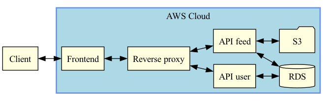

# Udagram Microservice Application

Udagram is a simple cloud application developed alongside the Udacity Cloud Engineering Nanodegree. It allows users to register and log into a web client, post photos to the feed.

The project is split into three parts:

1. Frontend - Angular web application built with Ionic Framework
2. Reverse proxy - Service that forward request from the client to the backend services 
3. Backend RESTful API - 2 Node-Express applications for the feed and user

Application structure


## Getting Started

> _tip_: it's recommended that you start with getting the backend API running since the frontend web application depends on the API.

### Prerequisite

1. The depends on the Node Package Manager (NPM). You will need to download and install Node from [https://nodejs.com/en/download](https://nodejs.org/en/download/). This will allow you to be able to run `npm` commands.
2. Environment variables will need to be set. These environment variables include database connection details that should not be hard-coded into the application code.

#### Environment Script

A file named `set_env.sh` has been prepared as an optional tool to help you configure these variables on your local development environment.

We do _not_ want your credentials to be stored in git. After pulling this `starter` project, run the following command to tell git to stop tracking the script in git but keep it stored locally. This way, you can use the script for your convenience and reduce risk of exposing your credentials.
`git rm --cached set_env.sh`

Afterwards, we can prevent the file from being included in your solution by adding the file to our `.gitignore` file.

### 1. Database

Create a PostgreSQL database either locally or on AWS RDS. The database is used to store the application's metadata.

- We will need to use password authentication for this project. This means that a username and password is needed to authenticate and access the database.
- The port number will need to be set as `5432`. This is the typical port that is used by PostgreSQL so it is usually set to this port by default.

Once your database is set up, set the config values for environment variables prefixed with `POSTGRES_` in `set_env.sh`.

- If you set up a local database, your `POSTGRES_HOST` is most likely `localhost`
- If you set up an RDS database, your `POSTGRES_HOST` is most likely in the following format: `***.****.us-west-1.rds.amazonaws.com`. You can find this value in the AWS console's RDS dashboard.

### 2. S3

Create an AWS S3 bucket. The S3 bucket is used to store images that are displayed in Udagram.

Set the config values for environment variables prefixed with `AWS_` in `set_env.sh`.

### 3. Backend API

Launch the backend APIs locally. The API is the application's interface to S3 and the database.

- To download all the package dependencies, run the command from the directory `udagram-api-feed/`:
  ```bash
  npm install .
  ```
- To run the application locally, run:
  ```bash
  npm run dev
  ```
- You can visit `http://localhost:8080/api/v0/feed` in your web browser to verify that the application is running. You should see a JSON payload. Feel free to play around with Postman to test the API's.

- Repeat process for `udagram-api-user/`

### 4. Frontend App

Launch the frontend app locally.

- To download all the package dependencies, run the command from the directory `udagram-frontend/`:
  ```bash
  npm install .
  ```
- Install Ionic Framework's Command Line tools for us to build and run the application:
  ```bash
  npm install -g ionic
  ```
- Prepare your application by compiling them into static files.
  ```bash
  ionic build
  ```
- Run the application locally using files created from the `ionic build` command.
  ```bash
  ionic serve
  ```
- You can visit `http://localhost:8100` in your web browser to verify that the application is running. You should see a web interface.

### 5. Docker

Run the product locally in a multi-container environment.

- Set up environmental variables
  ```bash
  source set_env.sh
  ```
- Create images
  ```bash
  ## Remove unused and dangling images
  docker image prune --all
  ## Run this command from the directory where you have the "docker-compose-build.yaml" file present
  docker compose -f docker-compose-build.yaml build --parallel
  ```
- Start application 
  ```bash
  docker-compose up
  ```
- Visit http://localhost:8100 in your web browser to verify that the application is running.
- Visit http://localhost:8080/api/v0/feed in your web browser to verify that the api is running.
  
### 6. Kubernetes Orchestration
- Create EKS Cluster
  ```
  eksctl create cluster --name {clusterName} --region=us-east-1 --nodes-min=2 --nodes-max=3
  ```
- Set up ConfigMap and Secret environmental variable files in `\deployments` directory
- Run script to set up K8s 
  ```bash
  bash build-kube.sh
  ```
- Set up load balancers to expose publicly the IPs of frontend and reverseproxy 
  ```bash
  kubectl expose deployment frontend --type=LoadBalancer --name=publicfrontend

  kubectl expose deployment reverseproxy --type=LoadBalancer --name=publicreverseproxy
  ```

- Update environmental variables in udagram-frontend/src/environments/environment.prod.ts and udagram-frontend/src/environments/environment.ts
  ```bash
  # view load balancer IPs
  kubectl get services
  ```
  ```bash
  # update apiHost variable in environment.ts files
  apiHost: 'http://some-url.us-east-1.elb.amazonaws.com:8080/api/v0'
  ```
- Rebuild frontend images with update
  ```bash
  # update version tag
  docker build . -t [Dockerhub-username]/udagram-frontend:v2 

  docker push [Dockerhub-username]/udagram-frontend:v2
   ```

- Update image on K8s
  ```bash
  kubectl set image deployment/frontend udagram-frontend=[Dockerhub-username]/udagram-frontend:v2
  ```
- Verify deployed application at public frontend IP

  
