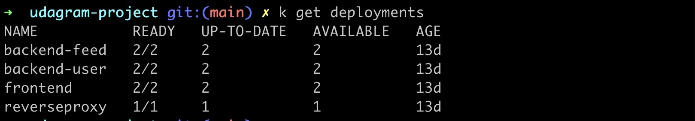
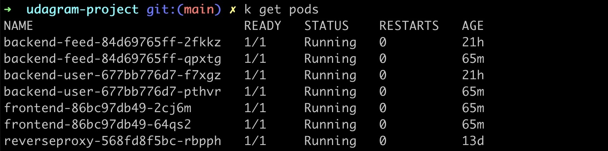
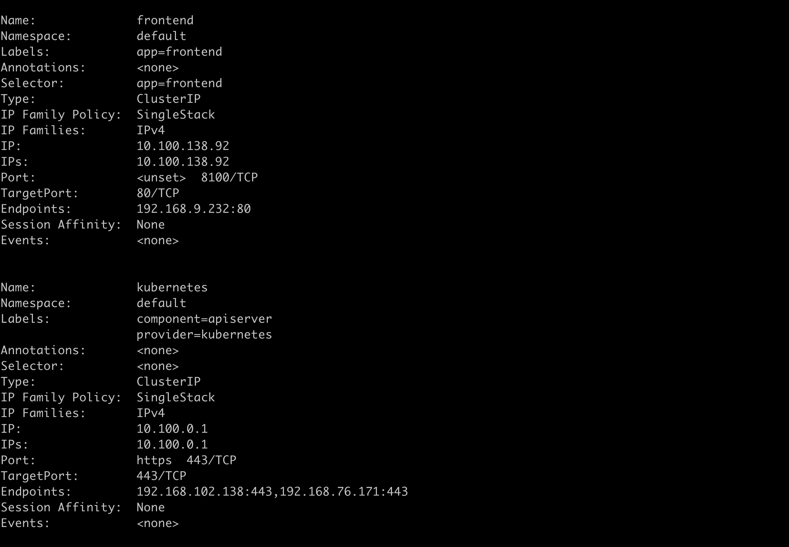
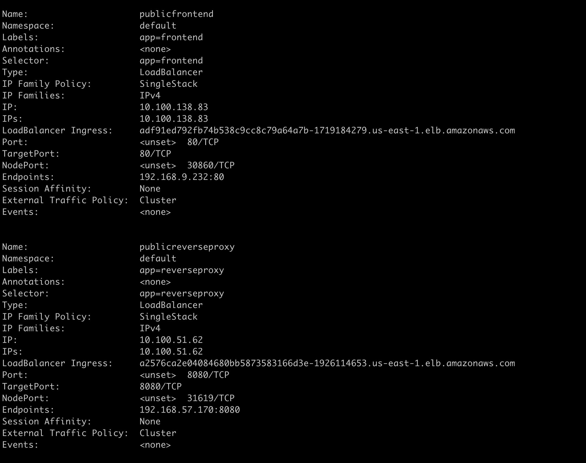
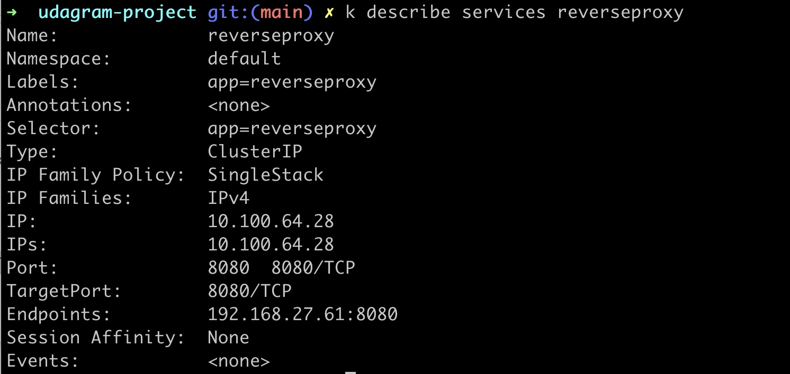
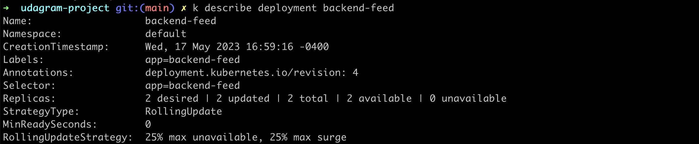

# Refactor Udagram App into Microservices and Deploy

## Containers and Microservices

### Divide an application into microservices
 ```bash
 ├── README.md
├── build-kube.sh
├── deployment
│   ├── aws-secret.yaml
│   ├── backend-feed-deployment.yaml
│   ├── backend-feed-service.yaml
│   ├── backend-user-deployment.yaml
│   ├── backend-user-service.yaml
│   ├── env-configmap.yaml
│   ├── env-secret.yaml
│   ├── frontend-deployment.yaml
│   ├── frontend-service.yaml
│   ├── reverseproxy-deployment.yaml
│   └── reverseproxy-service.yaml
├── docker-compose-build.yaml
├── docker-compose.yaml
├── env.list
├── set_env.sh
├── udagram-api-feed
│   ├── Dockerfile
│   ├── mock
│   ├── node_modules
│   ├── package-lock.json
│   ├── package.json
│   ├── src
│   ├── tsconfig.json
│   ├── tslint.json
│   └── www
├── udagram-api-user
│   ├── Dockerfile
│   ├── mock
│   ├── node_modules
│   ├── package-lock.json
│   ├── package.json
│   ├── src
│   ├── tsconfig.json
│   ├── tslint.json
│   └── www
├── udagram-api.postman_collection.json
├── udagram-frontend
│   ├── Dockerfile
│   ├── angular.json
│   ├── e2e
│   ├── ionic.config.json
│   ├── nginx.conf
│   ├── node_modules
│   ├── package-lock.json
│   ├── package.json
│   ├── src
│   ├── tsconfig.json
│   ├── tslint.json
│   ├── udagram_tests
│   └── www
└── udagram-reverseproxy
    ├── Dockerfile
    └── nginx.conf
```

### DockerHub images


## Independent Releases and Deployments

### Use Travis to build a CI/CD pipeline


## Service Orchestration with Kubernetes

### Deploy microservices using a Kubernetes cluster on AWS
[x] Deployments - screenshot

[x] Pods - screenshot

[x] Describe Services - screenshots




### Use a reverse proxy to direct requests to the appropriate backend
[x] Reverse proxy screenshot


### Configure scaling and self-healing for each service

[x] Kubernetes service replicas


[x] Autoscaling - screenshot


## Debugging, Monitoring, and Logging

### Use logs to capture metrics for debugging a microservices deployment

[x]
