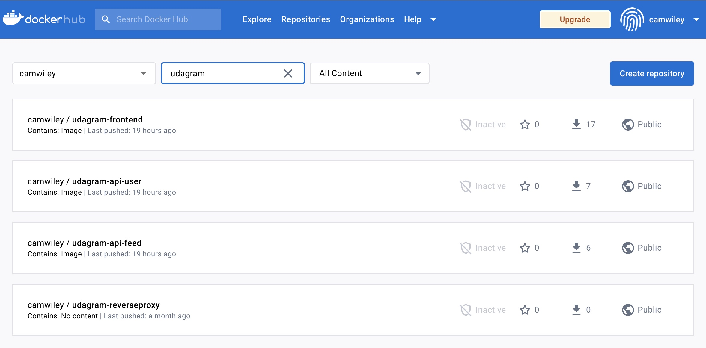

# Refactor Udagram App into Microservices and Deploy

## Containers and Microservices

### Divide an application into microservices
[x] /feed and /user backends are separated into
independent projects.


 ```bash
 ├── README.md
├── build-kube.sh
├── deployment
│   ├── aws-secret.yaml
│   ├── backend-feed-deployment.yaml
│   ├── backend-feed-service.yaml
│   ├── backend-user-deployment.yaml
│   ├── backend-user-service.yaml
│   ├── env-configmap.yaml
│   ├── env-secret.yaml
│   ├── frontend-deployment.yaml
│   ├── frontend-service.yaml
│   ├── reverseproxy-deployment.yaml
│   └── reverseproxy-service.yaml
├── docker-compose-build.yaml
├── docker-compose.yaml
├── env.list
├── set_env.sh
├── udagram-api-feed
│   ├── Dockerfile
│   ├── mock
│   ├── node_modules
│   ├── package-lock.json
│   ├── package.json
│   ├── src
│   ├── tsconfig.json
│   ├── tslint.json
│   └── www
├── udagram-api-user
│   ├── Dockerfile
│   ├── mock
│   ├── node_modules
│   ├── package-lock.json
│   ├── package.json
│   ├── src
│   ├── tsconfig.json
│   ├── tslint.json
│   └── www
├── udagram-api.postman_collection.json
├── udagram-frontend
│   ├── Dockerfile
│   ├── angular.json
│   ├── e2e
│   ├── ionic.config.json
│   ├── nginx.conf
│   ├── node_modules
│   ├── package-lock.json
│   ├── package.json
│   ├── src
│   ├── tsconfig.json
│   ├── tslint.json
│   ├── udagram_tests
│   └── www
└── udagram-reverseproxy
    ├── Dockerfile
    └── nginx.conf
```

----

### Build and run a container image using Docker


[x] Project includes Dockerfiles to successfully create Docker images for /feed, /user backends, project frontend, and reverse proxy.




----
<br>

## Independent Releases and Deployments

### Use Travis to build a CI/CD pipeline
[x] Screenshot of the Travis CI interface shows a successful build and deploy job.


  
<br>

## Service Orchestration with Kubernetes

### Deploy microservices using a Kubernetes cluster on AWS
[x] A screenshots of kubectl commands show the Frontend and API projects deployed in Kubernetes.


-----

[x] The output of kubectl get pods indicates that the pods are running successfully with the STATUS value Running.


-----

[x] The output of kubectl describe services does not expose any sensitive strings such as database passwords.


-----


### Use a reverse proxy to direct requests to the appropriate backend
[x] Screenshot of Kubernetes services shows a reverse proxy


----

### Configure scaling and self-healing for each service

[x] Kubernetes services are replicated. At least one of the Kubernetes services has replicas: defined with a value greater than 1 in itsdeployment.yml file.


----

[x] Screenshot of Kubernetes cluster of command kubectl describe hpa has autoscaling configured with CPU metrics.


----

<br>

## Debugging, Monitoring, and Logging

### Use logs to capture metrics for debugging a microservices deployment

[x] Backend API pod logs

